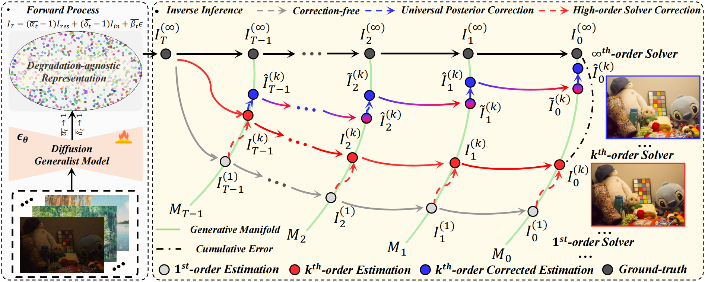
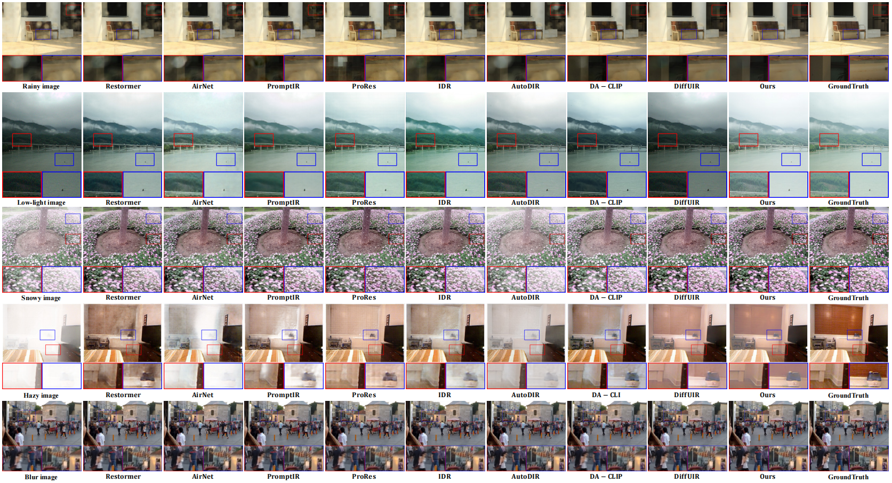

# Project

# DGSolver: Diffusion Generalist Solver with Universal Posterior Sampling for Image Restoration

<em>Hebaixu Wang, Jing Zhang, Haonan Guo, Di Wang, Jiayi Ma and Bo Du</em>.

[Paper](https://arxiv.org/abs/2504.21487) |  [Github Code](https://github.com/MiliLab/DGSolver)

## Abstract

Diffusion models have achieved remarkable progress in universal image restoration. While existing methods speed up inference by reducing sampling steps, substantial step intervals often introduce cumulative errors. Moreover, they struggle to balance the commonality of degradation representations and restoration quality. To address these challenges, we introduce \textbf{DGSolver}, a diffusion generalist solver with universal posterior sampling. We first derive the exact ordinary differential equations for generalist diffusion models and tailor high-order solvers with a queue-based accelerated sampling strategy to improve both accuracy and efficiency. We then integrate universal posterior sampling to better approximate manifold-constrained gradients, yielding a more accurate noise estimation and correcting errors in inverse inference. Extensive experiments show that DGSolver outperforms state-of-the-art methods in restoration accuracy, stability, and scalability, both qualitatively and quantitatively.

## Overview

## Visualization

## Datasets Information

| Task                     | Dataset                        | Synthetic/Real      | Download Links |
|--------------------------|--------------------------------|---------------------|----------------|
| **Deraining**            | DID                            | Synthetic           | [URL](https://github.com/hezhangsprinter/DID-MDN)                                                                                       |
|                          | DeRaindrop                     | Real                | [URL](https://github.com/rui1996/DeRaindrop)                                                                                            |
|                          | Rain13K                        | Synthetic           | [URL](https://github.com/kuijiang94/MSPFN)                                                                                              |
|                          | Rain_100H                      | Synthetic           | [URL](https://github.com/kuijiang94/MSPFN)                                                                                              |
|                          | Rain_100L                      | Synthetic           | [URL](https://github.com/kuijiang94/MSPFN)                                                                                              | 
|                          | GT-Rain                        | Real                | [URL](https://github.com/UCLA-VMG/GT-RAIN)                                                                                              | 
|                          | RealRain-1k                    | Real                | [URL](https://github.com/hiker-lw/RealRain-1k)                                                                                          | 
| **Low-light Enhancement**| LOL                            | Real                | [URL](https://github.com/weichen582/RetinexNet?tab=readme-ov-file)                                                                      |
|                          | MEF                            | Real                | [URL](https://ieeexplore.ieee.org/abstract/document/7120119)                                                                            |
|                          | VE-LOL-L                       | Synthetic/Real      | [URL](https://flyywh.github.io/IJCV2021LowLight_VELOL/)                                                                                 | 
|                          | NPE                            | Real                | [URL](https://ieeexplore.ieee.org/abstract/document/6512558)                                                                            | 
| **Desnowing**            | CSD                            | Synthetic           | [URL](https://github.com/weitingchen83/ICCV2021-Single-Image-Desnowing-HDCWNet)                                                         | 
|                          | Snow100K-Real                  | Real                | [URL](https://sites.google.com/view/yunfuliu/desnownet)                                                                                 |
| **Dehazing**             | SOTS                           | Synthetic           | [URL](https://sites.google.com/view/reside-dehaze-datasets/reside-standard?authuser=3D0)                                                | 
|                          | ITS_v2                         | Synthetic           | [URL](https://sites.google.com/view/reside-dehaze-datasets/reside-standard?authuser=3D0)                                                | 
|                          | D-HAZY                         | Synthetic           | [URL](https://www.cvmart.net/dataSets/detail/559?channel_id=op10&utm_source=cvmartmp&utm_campaign=datasets&utm_medium=article)          |
|                          | NH-HAZE                        | Real                | [URL](https://data.vision.ee.ethz.ch/cvl/ntire20/nh-haze/)                                                                              |
|                          | Dense-Haze                     | Real                | [URL](https://data.vision.ee.ethz.ch/cvl/ntire19/dense-haze/)                                                                           |
|                          | NHRW                           | Real                | [URL](https://github.com/chaimi2013/3R)                                                                                                 | 
| **Deblur**               | GoPro                          | Synthetic           | [URL](https://github.com/SeungjunNah/DeepDeblur-PyTorch)                                                                                | 
|                          | RealBlur                       | Real                | [URL](https://github.com/rimchang/RealBlur)                                                                                             | 

## Model Checkpoint

[Google Cloud](https://drive.google.com/file/d/1cc7WkG2E8gGKEzBt7WZFXmkpV7VzLWk7/view?usp=drive_link)

[Baidu Cloud](https://pan.baidu.com/s/1CvZ2HAiwqM1t2VOJe5dYkg?pwd=fz2d)[fz2d]

[Huggingface](https://huggingface.co/BaiXuYa/DGSolver)

### Contributor

Baixuzx7 @ wanghebaixu@gmail.com

### Copyright statement

The project is signed under the MIT license, see the [LICENSE.md](https://github.com/MiliLab/DGSolver/LICENSE.md)
